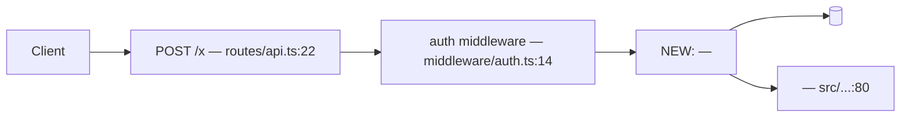

# architecture

Phase 3 answers one question: **how do the pieces fit — which modules exist, what flows between them, and where does this change land in the system that is already here?** It produces `<workspace>/work/<slug>/ARCHITECTURE.md`: the map at module scale, with every new endpoint, table, query and seam named.

This file names the modules and their seams. [program-design.md](program-design.md) specifies what the code inside them looks like — call stack, file paths, signatures, tests. Hold that boundary in both directions: an architecture that starts writing function signatures has spent the next phase's budget in the wrong session, and an architecture that stops at "we will add a service" leaves the expensive decision to be made mid-implementation at 70% context, where Law 5 says it is no longer cheap to change. Architecture runs on `main`: no worktree, nothing here writes code.

## Order

```bash
node ${CLAUDE_SKILL_DIR}/scripts/state.mjs phase architecture
node ${CLAUDE_SKILL_DIR}/scripts/skills.mjs resolve architecture
```

Re-read the inputs (Step 1) → reuse before addition (Step 2) → place the change in the incumbent path (Step 3) → justify every seam (Step 4) → write `ARCHITECTURE.md` (Step 5) → ADR the door-closing decisions (Step 6). `skills.mjs resolve architecture` names `code-structure` when operational logic is already duplicated across flows, and `drawio-skill` when the diagram must be editable or exported. `drawio-skill` needs the draw.io desktop CLI; without it, Mermaid inside the artifact renders in markdown and in published artifacts with no external binary. Use Mermaid by default.

## Step 1 — Re-read the inputs; do not design from memory

Open `<workspace>/work/<slug>/RESEARCH.md` and `PRD.md` now, in this session, even if you wrote them an hour ago. Facts lose the attention competition against more recent tokens, and a design built on a remembered version of the research is exactly how a misread early fact becomes an architecture several PRs later. Two sections carry most of the design: **What varies and what is fixed** is your entire seam budget — nothing outside that table has earned an interface — and **How information flows** is the incumbent path your change edits, not a greenfield sketch drawn beside it.

If the PRD's success metric cannot be observed anywhere in the architecture you are about to draw, either it has no instrumentation point or the design misses the thing being measured. Fix it here and `state.mjs note ruling` it; a metric with nowhere to be read from becomes an unverifiable claim at [verify.md](verify.md). Capability claims about any named service — ordering guarantees, delivery semantics, quotas, hard limits — resolve through Context7, never memory: `npx ctx7@latest library "<name>" "<question>"` then `docs <id> "<question>"`. An architecture built on a guarantee the service does not make is discovered during implementation, when the fix is a redesign rather than a paragraph.

## Step 2 — Reuse before addition, and the deletion test at subsystem scale

Before naming a new module, name the existing module that would otherwise have to change, and state why changing it is worse. The default failure of this phase is a new subsystem parked beside a working one that already does most of the job: across 211M tracked lines, duplicated blocks grew 4–8× while "moved lines" — the consolidation signal — fell from a quarter of all changes to under a tenth. Agents add; they do not consolidate. The deletion test applies to whole subsystems, not just functions — imagine the proposed piece deleted and its callers wired straight through:

| Proposed piece | Delete it — what happens | Verdict |
|---|---|---|
| `NotificationService` wrapping one SES call | complexity moves to its single caller and shrinks | fold into the caller |
| `PaymentGateway` over Stripe + invoicing + retries | the same logic reappears at 4 call sites | keep; the 4 sites are its justification |
| `UserRepo` that forwards each method to the ORM | nothing changes but the import path | delete; it is a pass-through |

A pass-through subsystem is worse than no subsystem: it adds a hop every maintainer must read through and hides nothing. Record each verdict in the artifact so the next session does not re-propose the module you just folded.

## Step 3 — Place the change in the path that already exists

For every hop the change touches, name the existing file and the line where it lands. A design that cannot say which existing file changes is a design for a different codebase, and it is why implementation later "discovers" that the real entry point was somewhere else entirely. Follow the house pattern: if RESEARCH.md's **Prior art** shows this shape of problem already solved here, solve it the same way. A better pattern nothing else in the repo follows costs every future reader a second mental model. Deviating is allowed — it is a door-closing decision and goes to an ADR (Step 6).

Decompose so a vertical slice is possible (Law 6). If module boundaries run purely by layer — all schema, then all services, then all UI — the plan phase cannot cut a thin end-to-end slice out of them, and implementation builds horizontally with nothing testable until the end. Check now: can one user-visible behaviour be delivered by touching one module per hop? If not, redraw the boundaries.

## Step 4 — Every seam needs something that actually varies

A seam is a place behaviour can be altered without editing in that place. **One adapter is a hypothetical seam; two is a real one.** Justify each seam with a row from the varies table or a variation the PRD requires on day one. Everything else gets a concrete call and no interface. This is the measured failure mode of agent-authored structure: chained forward, high-complexity function counts climb 4.1 → 37.0 on average and structural erosion rises in 80% of trajectories — abstraction gets added continuously and removed never. A seam that exists "in case we swap it later" is the first brick of that. Smell check: if you would need to test past the seam to be confident the thing works, the seam is in the wrong place — its interface does not carry the behaviour that matters. Move it or drop it.

## Step 5 — Write ARCHITECTURE.md

````markdown
# Architecture: <slug>

## Shape of this change
[One paragraph: new subsystem / extension of an existing one / replacement / confined to one
module. Say which — it sets the review the user should give this.]

## Modules
| Module | New / Changed / Unchanged | Owns (one line) | Deletion test |
|---|---|---|---|
| <name> | New | <the single responsibility> | kept — logic recurs at <N> callers: <list> |

## Data flow

[Mark every new node NEW: an undifferentiated diagram hides the size of the change.]

## Where it lands
| Hop | Existing file:line | What changes |
|---|---|---|
| <entry> | `routes/api.ts:22` | new route registered |
| <hop> | `upload/handler.ts:41` | calls <new module> instead of inlining it |

## New endpoints
| Method + path | Auth | Request | Response | Error cases |
|---|---|---|---|---|
| POST /v1/<x> | <scheme, from the incumbent middleware> | <fields> | <shape + status> | <status → when> |

## Data model
[New tables and columns with types; indexes and what each exists for; migration direction and
whether it reverses; backfill and its runtime. Credentials named by env var only — never a
connection string, never a value (Law 10).]

## Queries this must serve
[Every new table lists at least one read it exists to answer, as SQL or as the call that makes
it. A schema chosen without its read path becomes a table needing a second table to be usable,
discovered after data is in it.]

## Failure behaviour
[Per hop: what fails (timeout, partial write, duplicate delivery) and what the system does
about it (retry, idempotency key, dead-letter, user-visible error). Behaviour only — the
exception types and catch sites belong to the next phase.]

## Seams
| Seam | What varies behind it | Adapters today | Why it is real |
|---|---|---|---|
| <name> | <the varying thing> | <adapter 1>, <adapter 2> | two live implementations / PRD requires both on day one |

## Reuse decisions
[What already existed and is reused, cited. What was rejected as a reuse candidate and why it
did not fit — this stops the next session re-proposing the module you folded.]

## Non-goals
[What this deliberately does not support, so nobody builds toward it by accident.]

## Decisions that close doors
[One line per ADR with its path: `docs/adr/0007-queue-choice.md` — <the decision>.]

## Open for program-design
[Questions deliberately left to the next phase, so they are carried rather than lost.]
````

## Step 6 — ADR anything that closes a door

A decision that forecloses future options gets its own file at `docs/adr/NNNN-<slug>.md`, not a line in a chat log. A future session arrives with none of this session's context; without the written alternatives it re-litigates the choice from scratch or quietly reverses it and breaks the invariant that depended on it. Keep it in the filesystem, where it is greppable and where it survives the ledger being archived with this work item.

```markdown
# ADR-000N: <decision in five words>
Status: accepted | superseded by ADR-000M
Context: <the forces — from RESEARCH.md, cited>
Decision: <what we are doing>
Alternatives rejected: <option> — <why not>; <option> — <why not>
Cost if wrong: <what has to be undone, and roughly how much>
```

| Decision | ADR? |
|---|---|
| A datastore, queue or framework the project does not already use | Yes |
| A schema or event shape other services will read; an invariant callers must uphold | Yes |
| Deviating from a house pattern the repo already uses | Yes |
| A reversible split inside one module | No — a ledger ruling is enough |
| File naming, helper placement, signatures | No — [program-design.md](program-design.md) |

Then `state.mjs note decision "ADR-000N: <one line>"` so the session record points at the file. An ADR is not a stall (Law 8): decide, write the cost-if-wrong, continue.

## What belongs here vs program-design

| Question | Here | [program-design.md](program-design.md) |
|---|---|---|
| Which modules exist, what each owns, what flows between them | Yes | — |
| New endpoints, tables, indexes, the queries they serve | Yes | — |
| Where the seams are and what varies behind them | Yes | — |
| What happens when a hop fails | Yes (behaviour) | Yes (types, catch sites, retry counts) |
| File paths, signatures, call stack, the test list | — | Yes |

## Exit condition

All six must be true before [program-design.md](program-design.md) begins. Then report in a few lines — the shape of the change, what is reused rather than added, the seams and what varies behind each, any ADR written — because a page of architecture is reviewable in minutes and the thousands of lines built on it are not.

1. `<workspace>/work/<slug>/ARCHITECTURE.md` exists with every section above and no bracketed placeholders left in.
2. Every module in the Modules table is marked New / Changed / Unchanged, and every New one carries a deletion-test verdict naming the callers that make it earn its keep.
3. Every seam names something that varies today with its adapters listed, or a variation the PRD requires on day one. A seam with one adapter and no named second is deleted before this phase ends.
4. Every new table lists at least one query it must serve; every new endpoint lists auth and error cases.
5. "Where it lands" names an existing `file:line` for each hop the change touches — or the artifact states plainly that this is greenfield with no incumbent path.
6. Every door-closing decision has an ADR file on disk with its alternatives and cost-if-wrong, and the ledger notes it.

## What architecture does not do

It does not write code, signatures, or file layout. It does not answer a library or service question from memory. It does not restate RESEARCH.md — it cites it. It does not add a module without saying what would break if it were deleted, nor an interface without naming the second thing that varies behind it. If it cannot decide something, that is a ruling with a cost-if-wrong (Law 8) or a line under "Open for program-design", never a parked session.
