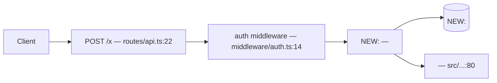

# architecture

Phase 3 answers one question: **how do the pieces fit — which modules exist, what flows between them, and where does this change land in the system that is already here?** It writes `<workspace>/work/<slug>/ARCHITECTURE.md`: the map at module scale, with every new endpoint, table, query and seam named. This file names the modules and their seams; [program-design.md](program-design.md) settles what the code inside them looks like — call stack, file paths, signatures, tests. Hold that boundary both ways: an architecture that writes function signatures has spent the next phase's budget in the wrong session, and an architecture that stops at "we will add a service" leaves the expensive decision to implementation at 70% context, where Law 5 says it is no longer cheap to change. Nothing here writes code, so nothing here needs a worktree — this phase runs on `main`.

## Order

```bash
node ${CLAUDE_SKILL_DIR}/scripts/state.ts phase architecture
node ${CLAUDE_SKILL_DIR}/scripts/skills.ts resolve architecture
```

`resolve` names `code-structure` when operational logic is already duplicated across flows or you are deciding what belongs in a shared service; `drawio-skill` when there are 3+ components and a diagram carries them better than prose; and the external `humanlayer-codebase-design`, source of the module/seam/depth vocabulary, fetchable with `node ${CLAUDE_SKILL_DIR}/scripts/skills.ts fetch humanlayer-codebase-design`. Installed → use it. Missing → give the user the install or find line `resolve` printed, then take the `degrade` path it names and say out loud you are on it (Law 9). `drawio-skill` needs the draw.io desktop CLI; without it Mermaid renders in markdown and in published artifacts with no external binary, so **Mermaid is the default** and draw.io is for when the user needs an editable or exported file.

## Step 1 — Re-read the inputs; do not design from memory

Open `<workspace>/work/<slug>/RESEARCH.md` and `PRD.md` now, in this session, even if you wrote them an hour ago. Instructions lose the attention competition against more recent tokens, and a design built on a remembered version of the research is exactly how a misread early fact becomes an architecture several PRs later. Two sections carry most of the work: **What varies and what is fixed** is your entire seam budget — nothing outside that table has earned an interface — and **How information flows** is the incumbent path your change edits, not a greenfield sketch drawn beside it. If an upstream phase was skipped and its file is absent, name the missing file in the artifact and design from what exists; do not reconstruct it by inference, because a fabricated requirement is worse than an absent one — every phase downstream then optimises honestly against a lie.

If the PRD's success metric cannot be read from anywhere in the architecture you are about to draw, either the design misses the thing being measured or it has no instrumentation point. Fix it here and `node ${CLAUDE_SKILL_DIR}/scripts/state.ts note ruling "<what you changed and why>"`. A metric with nowhere to be read from becomes an unverifiable claim at [verify.md](verify.md).

Capability claims about any named service — ordering guarantees, delivery semantics, quotas, hard limits — resolve through Context7, never memory: `npx ctx7@latest library "<name>" "<question>"` then `npx ctx7@latest docs <id> "<question>"`. An architecture built on a guarantee the service does not make is discovered during implementation, when the fix is a redesign rather than a paragraph.

## Step 2 — Reuse before addition, and the deletion test at subsystem scale

Before naming a new module, name the existing module that would otherwise have to change, and state why changing it is worse. The default failure of this phase is a new subsystem parked beside a working one that already does most of the job: across 211M tracked lines, duplicated blocks grew 4–8× while "moved lines" — the consolidation signal — fell from a quarter of all changes to under a tenth. Agents add; they do not consolidate. The deletion test applies to whole subsystems, not just functions — imagine the proposed piece deleted and its callers wired straight through:

| Proposed piece | Delete it — what happens | Verdict |
|---|---|---|
| `NotificationService` wrapping one SES call | complexity moves to its single caller and shrinks | fold into the caller |
| `PaymentGateway` over Stripe + invoicing + retries | the same logic reappears at 4 call sites | keep; the 4 sites are its justification |
| `UserRepo` forwarding each method to the ORM | nothing changes but the import path | delete; it is a pass-through |

A pass-through subsystem is worse than no subsystem: it adds a hop every maintainer must read through and hides nothing. Record each verdict under *Reuse decisions* so the next session does not re-propose the module you just folded.

## Step 3 — Place the change in the path that already exists

For every hop the change touches, name the existing `file:line` where it lands. A design that cannot say which existing file changes is a design for a different codebase, and it is why implementation later "discovers" that the real entry point was somewhere else. Follow the house pattern: if RESEARCH.md's *Prior art in this repo* shows this shape of problem already solved here, solve it the same way — a better pattern nothing else in the repo follows costs every future reader a second mental model. Deviating is allowed; it is a door-closing decision and goes to an ADR (Step 6).

Decompose so a vertical slice is possible (Law 6). If module boundaries run purely by layer — all schema, then all services, then all UI — the plan phase cannot cut a thin end-to-end slice out of them, and implementation builds horizontally with nothing testable until the end, exactly when re-steering is most expensive. Check it concretely before moving on: name one user-visible behaviour and the single module per hop that delivers it. If you cannot, redraw the boundaries now.

## Step 4 — Every seam needs something that actually varies

A seam is a place behaviour can be altered without editing in that place. **One adapter is a hypothetical seam; two is a real one.** Justify each seam with a row from the varies table or a variation the PRD requires on day one; everything else gets a concrete call and no interface. This is the measured failure mode of agent-authored structure: chained forward on its own output, average high-complexity function counts climb 4.1 → 37.0 and structural erosion rises in 80% of trajectories — abstraction gets added continuously and removed never, and a seam that exists "in case we swap it later" is the first brick of it. Smell check: if you would need to test past the seam to be confident the thing works, its interface does not carry the behaviour that matters. Move it or drop it.

## Step 5 — Write ARCHITECTURE.md

Fill this skeleton. Keep it under 150 lines — a page of architecture is reviewable in one sitting and the thousands of lines built on it are not, which is the whole reason this phase is a checkpoint.

````markdown
# Architecture: <slug>

## Shape of this change
[One paragraph: new subsystem / extension of an existing one / replacement / confined to one module.
Say which — it sets the review the user should give this.]

## Modules
| Module | New / Changed / Unchanged | Owns (one line) | Deletion test |
|---|---|---|---|
| <name> | New | <the single responsibility> | kept — logic recurs at <N> callers: <list> |

## Data flow

[Every node carries its `file:line` where one exists; every new node is prefixed `NEW:`. An undifferentiated diagram hides the size of the change from the person reviewing it.]

## Where it lands
| Hop | Existing file:line | What changes |
|---|---|---|
| <entry> | `routes/api.ts:22` | new route registered; calls <new module> instead of inlining it |

## New endpoints
| Method + path | Auth | Request | Response | Error cases |
|---|---|---|---|---|
| POST /v1/<x> | <scheme, from the incumbent middleware> | <fields> | <shape + status> | <status → when> |

## Data model
| Table.column | Type | Null | Index and what it is for | Exists for |
|---|---|---|---|---|
[Then migration direction, whether it reverses, backfill and its runtime. Credentials named by env var only — never a connection string, never a value (Law 10).]

## Queries this must serve
| New table | Read it must answer | Query or call | Index it uses |
|---|---|---|---|
[At least one row per new table. A schema chosen without its read path becomes a table that needs a second table to be usable, discovered after production data is in it.]

## Failure behaviour
| Hop | What fails | What the system does |
|---|---|---|
| <hop> | timeout / partial write / duplicate delivery | retry, idempotency key, dead-letter, user-visible error |
[Behaviour only. Exception types, catch sites and retry counts belong to the next phase.]

## Seams
| Seam | What varies behind it | Adapters today | Why it is real |
|---|---|---|---|
| <name> | <the varying thing> | <adapter 1>, <adapter 2> | two live implementations / PRD requires both on day one |

## Reuse decisions
[What already existed and is reused, cited. What was rejected as a reuse candidate and why it did not fit — this stops the next session re-proposing the module you just folded.]

## Non-goals
[What this deliberately does not support, so nobody builds toward it by accident.]

## Decisions that close doors
[One line per ADR with its path: `docs/adr/0007-queue-choice.md` — <the decision>.]

## Open for program-design
[Questions deliberately left to the next phase, so they are carried rather than lost.]
````

## Step 6 — ADR anything that closes a door

A decision that forecloses future options gets its own file at `docs/adr/NNNN-<slug>.md`, not a line in a chat log. A future session arrives with none of this session's context; without the written alternatives it re-litigates the choice from scratch or quietly reverses it and breaks the invariant that depended on it. Keep it in the filesystem, where it is greppable and where it outlives the ledger being archived with this work item.

```markdown
# ADR-000N: <decision in five words>
Status: accepted | superseded by ADR-000M
Context: <the forces — from RESEARCH.md, cited>
Decision: <what we are doing>
Alternatives rejected: <option> — <why not>; <option> — <why not>
Cost if wrong: <what has to be undone, and roughly how much>
```

| Decision | ADR? |
|---|---|
| A datastore, queue or framework the project does not already use | Yes |
| A schema or event shape other services will read; an invariant callers must uphold | Yes |
| Deviating from a house pattern the repo already uses | Yes |
| A reversible split inside one module | No — a ledger ruling is enough |

Then `node ${CLAUDE_SKILL_DIR}/scripts/state.ts note decision "ADR-000N: <one line>"` so the session record points at the file. An ADR is not a stall (Law 8): decide, write the cost-if-wrong, continue.

## Here vs program-design

| Question | Here | [program-design.md](program-design.md) |
|---|---|---|
| Which modules exist, what each owns, what flows between them | Yes | — |
| New endpoints, tables, indexes, and the reads they serve | Yes | — |
| Which seams exist and what varies behind each | Yes | the interface file and the adapter list |
| What happens when a hop fails | Yes — behaviour | Yes — types, catch sites, retry counts |
| File paths, signatures, call stack, the test list | — | Yes |

## Exit condition

All seven true before [program-design.md](program-design.md) starts.

1. `wc -l <workspace>/work/<slug>/ARCHITECTURE.md` is ≤ 150 and `grep -n '^\[' <workspace>/work/<slug>/ARCHITECTURE.md` returns nothing — every section present, no template prose left in.
2. Every module is marked New / Changed / Unchanged, and every New one carries a deletion-test verdict naming the callers that make it earn its keep.
3. Every seam names something that varies today with two or more adapters listed, or a variation the PRD requires on day one. A seam with one adapter and no named second is deleted before this phase ends, not carried as "future".
4. Every new table has at least one row under *Queries this must serve*; every new endpoint states auth and error cases.
5. *Where it lands* names an existing `file:line` for each hop the change touches — or the artifact states plainly that this is greenfield with no incumbent path.
6. Every door-closing decision has a file under `docs/adr/` carrying its alternatives and cost-if-wrong, and `state.ts note decision` points at it.
7. One user-visible behaviour is named that a single module per hop can deliver end to end (Law 6).

Then report in five lines: the shape of the change, what is reused rather than added, each seam and what varies behind it, any ADR written, and what is left open. Anything you could not settle is a ruling with a cost-if-wrong (Law 8) or a line under *Open for program-design* — never a parked session and never a thinner artifact. If context is tight, hand off ([context-discipline.md](context-discipline.md)) and let a fresh session write this file: compressing it here is Law 2's failure, and the design written at the end of a full window is the one the next four phases inherit.
